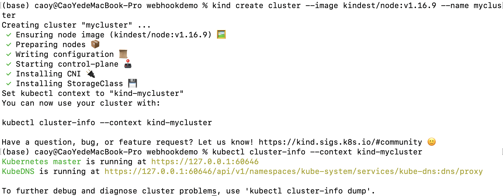
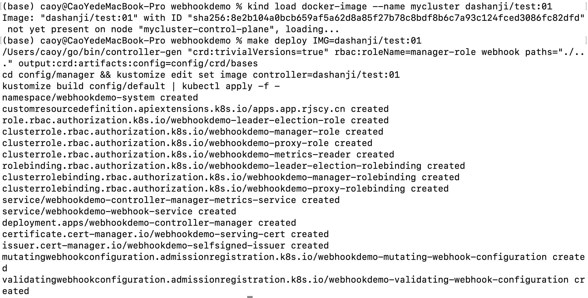
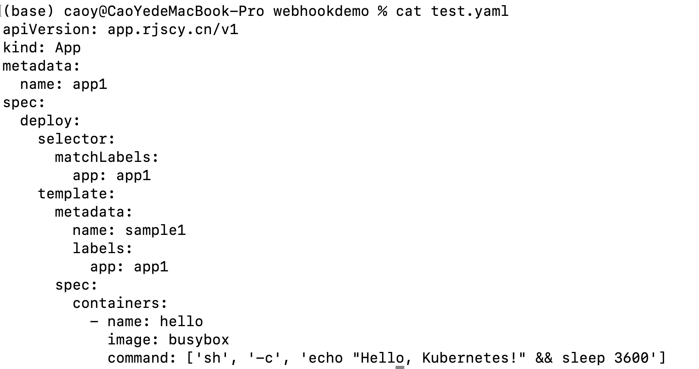
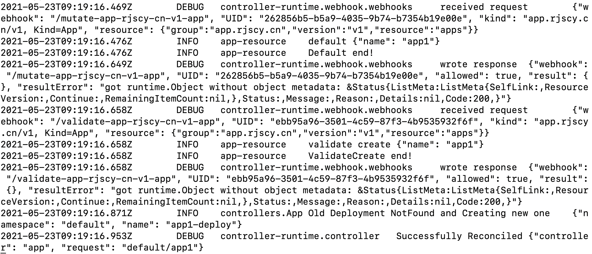

### 基于Kubebuilder的Webhook搭建教程

#### 说明

本文项目基于https://github.com/zwwhdls/KubeAdmissionWebhookDemo。

主要实现了一个向pod注入nginx容器的webhook。

#### 主要步骤

1、本文环境为

```
GO : go version go1.15.12 darwin/amd64
KubeBuilder : v2.3.2
kindest/node : v1.16.9
```

2、为了避免一些错误的发生，在第三步创建kind集群和第四步应用cert-manager的时候，尽量不使用代理，一个方法是先开代理进行第三步和第四步，这样本地就有对应的镜像，接着删除对应的kind集群，关闭代理，继续第三步。

3、创建kind集群

```
kind create cluster --image kindest/node:v1.16.9 --name mycluster 
```

创建结果如下所示，注意此时没有代理：



查看集群各组件是否正常运行：


4、应用cert-manager进行证书管理

```
kubectl apply -f cert-manager.yaml
```

查看cert-manager是否正常运行


5、开代理，构建容器镜像，注意该项目中的环境以及文件设置是已经配置好的，若要通过kubebuilder重新生成配置文件，可能会存在一些配置问题，故建议在此项目基础上进行二次开发。

```
make docker-build IMG=dashanji/test:01
```


6、将镜像加载到kind集群中

```
kind load docker-image --name mycluster dashanji/test:01
```


7、部署服务

```
make deploy IMG=dashanji/test:01
```



8、查看服务是否成功运行


在上图中可以看到，webhookdemo-controller正在运行，我们可以开启一个终端查看其中的manager信息

```
kubectl logs -f webhookdemo-controller-manager-84bb7988d7-9kjzl(此处应为本地webhookdemo-controller名称)  -n webhookdemo-system -c manager
```


至此，我们的webhook已经搭建成功，再开启一个终端进行测试。

9、测试

测试用的yaml文件如下



部署该app


接着查看manager输出的log信息，发现确实进行了mutate和validate调用。



通过查看POD，可以看到生成了两个容器

```
kubectl get po -A
```


继续查看细节信息，可以看到确实加入了nginx:1.12.2的容器

```
kubectl describe pod app1-deploy-6d7867c98c-m7hgg
```


